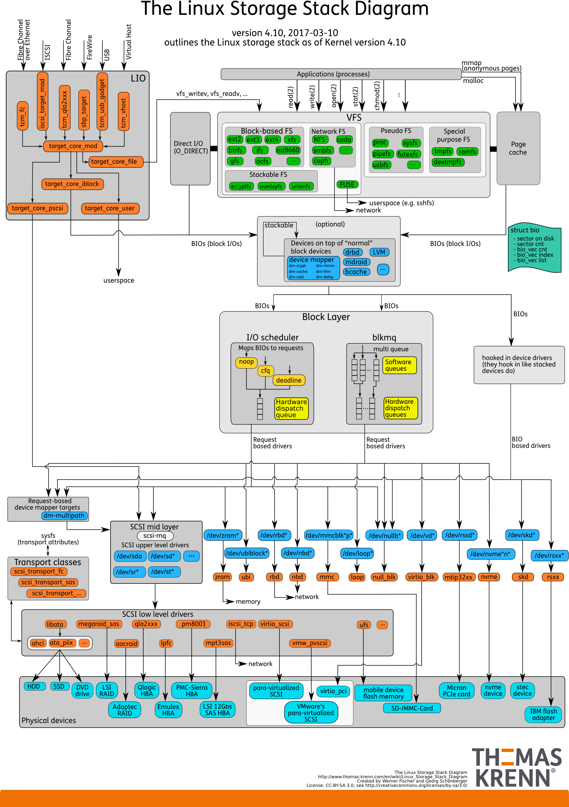

# Linux | Forensic Imaging | Quickstarts
There are many open-source tools out there to help with forensic imaging.

This section is all about the Linux tools.

## Setup
### Kali
You can quickly install useful packages for Forensic Tools in Kali: 
```bash
sudo apt install kali-tools-forensics
```
**Source:** https://www.kali.org/tools/kali-meta/#kali-tools-forensics
> **NOTE:** If you click on *Dependencies* you can see all the packages that will be installed.
## Forensic tools
- Sleuth Kit
- dcfldd
- foremost
- [...]
### Comes with *Kali tools forensics*
- [**afflib-tools**](https://packages.debian.org/unstable/afflib-tools) - The Advanced Forensic Format (AFF) is on-disk format for storing computer forensic information. Critical features of AFF include:
    - AFF allows you to store both computer forensic data and associated
   metadata in one or more files.
    - AFF allows files to be digital signed, to provide for
   chain-of-custody and long-term file integrity.
    - AFF allows for forensic disk images to stored encrypted and decrypted on-the-fly for processing. This allows disk images containing privacy sensitive material to be stored on the Internet.
- [**apktool**](https://packages.debian.org/unstable/apktool) -  A tool for reverse engineering 3rd party, closed, binary Android apps. It can decode resources to nearly original form and rebuild them after making some modifications; it makes possible to debug smali code step by step. Also it makes working with an app easier because of project-like file structure and automation of some repetitive tasks like building apk.
- [**autopsy**](https://packages.debian.org/unstable/autopsy) - The Autopsy Forensic Browser is a graphical interface to the command line digital forensic analysis tools in The Sleuth Kit. Together, The Sleuth Kit and Autopsy provide many of the same features as commercial digital forensics tools for the analysis of Windows and UNIX file systems (NTFS, FAT, FFS, EXT2FS, and EXT3FS).
- [**binwalk**](https://packages.debian.org/unstable/binwalk) - Binwalk is a tool for searching a given binary image for embedded files and executable code. Specifically, it is designed for identifying files and code embedded inside of firmware images. Binwalk uses the libmagic library, so it is compatible with magic signatures created for the Unix file utility. Binwalk also includes a custom magic signature file which contains improved signatures for files that are commonly found in firmware images such as compressed/archived files, firmware headers, Linux kernels, bootloaders, filesystems, etc.
- [**bulk-extractor**](https://github.com/simsong/bulk_extractor) or [Kali tools](https://www.kali.org/tools/bulk-extractor/) - bulk_extractor is a C++ program that scans a disk image, a file, or a directory of files and extracts useful information without parsing the file system or file system structures. The results are stored in feature files that can be easily inspected, parsed, or processed with automated tools. bulk_extractor also creates histograms of features that it finds, as features that are more common tend to be more important.
- [**bytecode-viewer**](https://github.com/Konloch/bytecode-viewer) or [Kali tools](https://www.kali.org/tools/bytecode-viewer/)- This package contains Bytecode Viewer (BCV). It is an Advanced Lightweight Java Bytecode Viewer, GUI Java Decompiler, GUI Bytecode Editor, GUI Smali, GUI Baksmali, GUI APK Editor, GUI Dex Editor, GUI APK Decompiler, GUI DEX Decompiler, GUI Procyon Java Decompiler, GUI Krakatau, GUI CFR Java Decompiler, GUI FernFlower Java Decompiler, GUI DEX2Jar, GUI Jar2DEX, GUI Jar-Jar, Hex Viewer, Code Searcher, Debugger and more. There is also a plugin system that will allow you to interact with the loaded classfiles, for example you can write a String deobfuscator, a malicious code searcher, or something else you can think of. You can either use one of the pre-written plugins, or write your own. It supports groovy scripting. Once a plugin is activated, it will execute the plugin with a ClassNode ArrayList of every single class loaded in BCV, this allows the user to handle it completely using ASM.
- [**cabextract**](https://packages.debian.org/unstable/cabextract) - Cabextract is a program which unpacks cabinet (.cab) files, which are a form of archive Microsoft uses to distribute their software and things like Windows Font Packs.
- [**chkrootkit**](https://packages.debian.org/unstable/chkrootkit) - The chkrootkit security scanner searches for signs that the system is infected with a 'rootkit'. Rootkits are a form of malware that seek to exploit security flaws to grant unauthorised access to a computer or its services, generally for malicious purposes.chkrootkit can identify signs of over 70 different rootkits (see the project's website for a list). Please note that an automated tool like chkrootkit can never guarantee a system is uncompromised. Nor does every report always signify a genuine problem: human judgement and further investigation will always be needed to assure the security of your system.
- [**creddump7**](https://packages.debian.org/unstable/creddump7) - This package contains a Python tool to extract various credentials and secrets from Windows registry hives. It's based on the creddump program. Many patches and fixes have been applied by Ronnie Flathers.
- [**dc3dd**](https://packages.debian.org/unstable/dc3dd) - dc3dd is a patched version of GNU dd with added features for computer forensics: 
    - on the fly hashing (md5, sha-1, sha-256, and sha-512)
    - possibility to write errors to a file
    - group errors in the error log
    - pattern wiping
    - progress report
    - possibility to split output
- [**dc3dd**](https://packages.debian.org/unstable/dcfldd) - dcfldd was initially developed at Department of Defense Computer Forensics Lab (DCFL). This tool is based on the dd program with the following additional features: 
    - Hashing on-the-fly: dcfldd can hash the input data as it is being
   transferred, helping to ensure data integrity.
    - Status output: dcfldd can update the user of its progress in terms of the
   amount of data transferred and how much longer operation will take.
    - Flexible disk wipes: dcfldd can be used to wipe disks quickly and with a
   known pattern if desired.
    - Image/wipe verify: dcfldd can verify that a target drive is a bit-for-bit
   match of the specified input file or pattern.
    - Multiple outputs: dcfldd can output to multiple files or disks at the same
   time.
    - Split output: dcfldd can split output to multiple files with more
   configurability than the split command.
    - Piped output and logs: dcfldd can send all its log data and output to
   commands as well as files natively.
    - When dd uses a default block size (bs, ibs, obs) of 512 bytes, dcfldd uses
   32768 bytes (32 KiB) which is HUGELY more efficient.
    - The following options are present in dcfldd but not in dd: ALGORITHMlog:,
   errlog, hash, hashconv, hashformat, hashlog, hashlog:, hashwindow, limit,
   of:, pattern, sizeprobe, split, splitformat, statusinterval, textpattern,
   totalhashformat, verifylog, verifylog:, vf.
- [**ddrescue**](http://www.garloff.de/kurt/linux/ddrescue/) or [Kali tools](https://www.kali.org/tools/ddrescue/) - When your disk has crashed and you try to copy it over to another one, standard Unix tools like cp, cat, and dd will abort on every I/O error, dd_rescue does not. It optimizes copying by using large blocks as long as no errors occur and falls back to smaller blocks. It supports reverse direction copying (to approach a bad spot from the top), sparse copying, preallocating space, splice zerocopy, and bypassing the kernel pagecache with O_DIRECT. dd_rescue provides safe deletion of data by overwriting files (or better partitions/disks) multiple times with fast random numbers. With the ddr_hash plugin, it supports calculating a hash value (such as a sha256sum) or an HMAC during copying.
- [**dumpzilla**](https://www.kali.org/tools/dumpzilla/) - Dumpzilla application is developed in Python 3.x and has as purpose extract all forensic interesting information of Firefox, Iceweasel and Seamonkey browsers to be analyzed. Due to its Python 3.x development, might not work properly in old Python versions, mainly with certain characters. Works under Unix and Windows 32/64 bits systems. Works in command line interface, so information dumps could be redirected by pipes with tools such as grep, awk, cut, sed… Dumpzilla allows one to visualize following sections, search customization and extract certain content.
- [**edb-debugger**](https://www.kali.org/tools/edb-debugger/) [GitHub](https://github.com/eteran/edb-debugger) - edb is a graphical cross platform x86/x86-64 debugger. It was inspired by Ollydbg, but aims to function on x86 and x86-64 as well as multiple OS’s. Linux is the only officially supported platform at the moment, but FreeBSD, OpenBSD, OSX and Windows ports are underway with varying degrees of functionality.
- [**edb-debugger** or **libewf**](https://www.kali.org/tools/libewf/) [GitHub](https://github.com/libyal/libewf-legacy) - Libewf is a library with support for reading and writing the Expert Witness Compression Format (EWF). This library allows you to read media information of EWF files in the SMART (EWF-S01) format and the EnCase (EWF-E01) format. It supports files created by EnCase 1 to 6, linen and FTK Imager. The libewf is useful for forensics investigations. This package contains tools to acquire, verify and export EWF files.
- [**exifprobe**](https://www.kali.org/tools/exifprobe/) [GitHub](https://github.com/hfiguiere/exifprobe) - Exifprobe reads image files produced by digital cameras (including several so-called “raw” file formats) and reports the structure of the files and the auxiliary data and metadata contained within them. In addition to TIFF, JPEG and EXIF, the program understands several formats which may contain “raw” camera data, including MRW, CIFF/CRW, JP2/JPEG2000, RAF, and X3F, as well as most TIFF-derived “raw” formats, including DNG, ORF, CR2, NEF, K25/KDC/DCR and PEF. This program is useful in forensics investigations.
- [**exiv2**](https://www.kali.org/tools/exiv2/) [Official website](https://www.exiv2.org/) - Exiv2 is a C++ library and a command line utility to manage image metadata. It provides fast and easy read and write access to the Exif, IPTC and XMP metadata of images in various formats. Exiv2 command line utility to: 
    - print Exif, IPTC and XMP image metadata in different formats:
        - Exif summary info, interpreted values, or the plain data for each tag
    - set, add and delete Exif, IPTC and XMP image metadata from command line modify commands or command scripts
    - adjust the Exif timestamp (that’s how it all started…)
    - rename Exif image files according to the Exif timestamp
    - extract, insert and delete Exif, IPTC and XMP metadata and JPEG comments
    - extract previews from RAW images and thumbnails from the Exif metadata
    - insert and delete the thumbnail image embedded in the Exif metadata
    - print, set and delete the JPEG comment of JPEG images
    - fix the Exif ISO setting of picture taken with Canon and Nikon cameras
- [**ext3grep**](https://www.kali.org/tools/ext3grep/) [Google Code](https://code.google.com/archive/p/ext3grep/) - ext3grep is a simple tool intended to aid anyone who accidentally deletes a file on an ext3 filesystem, only to find that they wanted it shortly thereafter. This package is useful in forensics investigations.
- [**ext4magic**](https://www.kali.org/tools/ext4magic/) [Official website](http://ext4magic.sf.net/ext4magic_en.html) - ext4magic is a file carver (or file carving). It can be used when recovering from disasters or in digital forensics activities. The deletion of files in ext3/4 filesystems can not be easily reversed. Zero out of the block references in the inodes makes that impossible. Experiences with other programs have proved that is possible restore sufficient information for a recover of many data files, directly from the filesystem journal. ext4magic can extract the information from the journal and restore files in an entire directory tree, if the information in the journal are sufficient. This tool can recover the most file types, with original filename, owner and group, file mode bits and also the old atime/mtime stamps.
- [**extundelete**](https://www.kali.org/tools/extundelete/) [SourceForge](http://extundelete.sourceforge.net/) - extundelete uses the information stored in the partition’s journal to attempt to recover a file that has been deleted. There is no guarantee that any particular file will be able to be undeleted.
- [**fcrackzip**](https://www.kali.org/tools/fcrackzip/) [Homepage](http://oldhome.schmorp.de/marc/fcrackzip.html) - fcrackzip is a fast password cracker partly written in assembler. It is able to crack password protected zip files with brute force or dictionary based attacks, optionally testing with unzip its results. It can also crack cpmask’ed images. This package is useful for pentesters, ethical hackers and forensics experts.
- [**firmware-mod-kit**](https://www.kali.org/tools/firmware-mod-kit/) [GitHub](https://github.com/rampageX/firmware-mod-kit) - The Firmware Mod Kit allows for easy deconstruction and reconstruction of firmware images for various embedded devices. While it primarily targets Linux based routers, it should be compatible with most firmware that makes use of common firmware formats and file systems such as TRX/uImage and SquashFS/CramFS.
- [**foremost**](https://www.kali.org/tools/foremost/) [SourceForge](https://sourceforge.net/projects/foremost/) - Foremost is a forensic program to recover lost files based on their headers, footers, and internal data structures. Foremost can work on image files, such as those generated by dd, Safeback, Encase, etc, or directly on a drive. The headers and footers can be specified by a configuration file or you can use command line switches to specify built-in file types. These built-in types look at the data structures of a given file format allowing for a more reliable and faster recovery.
- [**forensic-artifacts**](https://www.kali.org/tools/forensic-artifacts/) [GitHub](https://www.kali.org/tools/forensic-artifacts/) (`python3-artifacts`) - A free, community-sourced, machine-readable knowledge base of forensic artifacts that the world can use both as an information source and within other tools. This package installs the data files alone, without the Python toolkit.
- [**forensics-colorize**](https://www.kali.org/tools/forensics-colorize/) [GitHub](https://github.com/jessek/colorize) - forensics-colorize is a set of tools to visually compare large files, as filesystem images, creating graphics of them. It is intuitive because the produced graphics provide a quick and perfect sense about the percentage of changes between two files. Comparing large textual files using a simple diff can produce a very big result in lines, causing confusion. On the other hand, diff is improper to compare binary files. This package provides two command line programs: filecompare and colorize. The filecompare command is used to create a special and auxiliary input file for colorize. The colorize command will generate an intuitive graphic that will make easier to perceive the level of changes between the files.
- [****]()

## Command list
- `sg_raw` - send arbitrary SCSI or NVMe command to a device
- `dmesg` - print or control the kernel ring buffer
- `blockdev` - call block device ioctls from the command line
- `icat` - Output the contents of a file based on its inode number.
- `exif` - shows EXIF information in JPEG files
- `objdump` - display information from object files
- `fls` - List file and directory names in a disk image. (can display file names of recently deleted files for the directory using the given inode)
- `dd` - convert and copy a file
- `dmidecode` - DMI table decoder.
     > dmidecode is a tool for dumping a computer's DMI (some say SMBIOS) table contents in a human-readable format. This table contains a description of the system's hardware components, as well as other useful pieces of information  such as serial numbers and BIOS revision. Thanks to this table, you can retrieve this information without having to probe for the actual hardware. While this is a good point in terms of report speed and safeness, this also makes the presented information possibly unreliable.
     > 
     > The  DMI table doesn't only describe what the system is currently made of, it also can report the possible evolutions (such as the fastest supported CPU or the maximal amount of memory supported).
     >
     > SMBIOS stands for System Management BIOS, while DMI stands for Desktop Management Interface. Both standards are tightly related and developed by the DMTF (Desktop Management Task Force).
- `lshw` - list hardware
- `lsusb` - list USB devices
- `hdparm` - get/set SATA/IDE device parameters
- `smartctl` - Control and Monitor Utility for SMART Disks
- `mmls` - Display the partition layout of a volume system  (partition tables)
- `mmcat` - Output the contents of a partition to stdout
- `sedutil-cli` - Is a utility to manage self encrypting drives that conform to the Trusted Computing Group (TCG) OPAL 2.0 SSC specification.
- `hddtemp` - Utility to monitor hard drive temperature
- `mt` - Gives subcommands to streaming tape device.
- `nvme` - 
- `df` - report file system disk space usage
- `du` - estimate file space usage
- `gzip`, `gunzip`, `zcat` - compress or expand files
- `ewfverify` - verifies media data stored in EWF files 
- `affinfo` - print information about an AFF file
- `img_stat` - Display details of an image file 
- `dc3dd` - convert and copy a file
- `growisofs` - combined mkisofs frontend/DVD recording program.
- `mkisofs` - create an hybrid ISO9660/JOLIET/HFS filesystem with optional Rock Ridge attributes.
- `blkcat` - Display the contents of file system data unit in a disk image.
- `blkls` - List or output file system data units.
- `fsstat` - Display general details of a file system
- `gpart` - control utility for the disk partitioning GEOM class
- `dcfldd` - enhanced version of dd for forensics and security. Copy a file, converting and formatting according to the options.
- `veracrypt` - Free and open source disk encryption software.
- `udev` - Dynamic device management
- `udevadm` - udev management tool
- `mknod` - make block or character special files

## Setup
### Debian
- `sg3-utils` this includes tools like `sg_raw` (SCSI or NVMe disks)
```bash
sudo apt update
sudo apt install -y sg3-utils exif lshw hddtemp dc3dd
```
> This `apt install` was tested on Kali Linux.

## Storage Devices
- Everything on Unix/Linux systems is a *file*
    - Each file is of a specific type
        - regular files
        - directories
        - Block devices
        - character devices
        - named pipes
        - hard links
        - soft/symbolic links (similar to Microsoft Windows LNK files)

### Kernel Device Detection
- `/dev` dir stores files that correspond to devices
    - `/dev` raw disk device files have a naming convention: 
        - SATA & SCSI: *sd**
        - IDE: *hd**
        - RAID arrays: *md**
        - NVME drives: <em>nvme&#42;n&#42;</em>
        - [...]
    - Other devices of note: 
        - `/dev/null` - discards any data written to it
        - `/dev/zero` - steady stream of zeros
        - `/dev/random` - stream of random data
        - `/dev/st` - normally this is how tape drives start
        - `/dev/dvd` - media DVD
        - `/dev/cdrom` - media CD
        - `/dev/sr*` - majority of the time they are symbolic links
        - `/dev/sg*` - generic SCSI device driver interface
        - `/dev/sd*` - for SCSI and SATA
        - `/dev/hd*` - for IDE
        - `/dev/md*` - for RAID arrays
        - `/dev/nvme*n*` - for NVME drives
        - `/dev/loop*` - 
        - `/dev/mapper/*` - 
    - Each invidual partitions found by the Kernel are numbered (e.g.: sda1, sda2, hda1)
- Partition block devices == contiguous sequence of disk sectors
- `mknod` is the command for creation of devices files
    - It is done automatically
    - Past system: `devfs`
    - `udev` is the program that loads devices (the deamon can be `systemd-udevd`)
    - The Kernel is the one calling `udev`
    - The event information can also be found in the `dbus`

> IMPORTANT! Forensic tools should examine raw devices and partitions without the mounting of a filesystem.

> Operations for imaging are done at the block device below the system and partition scheme.

> When doing forensic acquisition and analysis activities, understanding Linux device tree is important
> 
> Important to find: 
> - suspect drive
> - write blocker
> - [...]

#### In `/dev` (storage)
- In `/dev` directory attached drives will appear as *block devices*
- A contiguous sequence of disk sectors are partition block devices
- A partition contains: 
    - filsesystem (that can be mounted by the kernel)

## Filesystems
- List of supported filesystems: https://en.wikipedia.org/wiki/Category:File_systems_supported_by_the_Linux_kernel
- VFS (Virtual File System) is a abstraction layer to provide a consistent interface for different file system types
- The VFS allows the mounting of: 
    - EXT&#42;
    - NTFS
    - FAT
    - network-based filesystems: 
        - nfs
        - sambafs/smbfs
    - userspace filesystems based on [FUSE](https://en.wikipedia.org/wiki/Filesystem_in_Userspace)
    - stackable filesystems
        - encryptfs
        - unionfs
    - other pseudo filesystems: 
        - sysfs
        - proc
    - many others 

> NOTE: When performing forensic acquisition file system support is not necessary.Imaging process is done at the block device level (it is under the file system and the partition scheme)

This diagram helps you understand the relationship among (within the Linux kernel):
- filesystems
- devices
- device drivers
- hardware devices


*The Linux Storage Stack Diagram (Source: https://www.thomas-krenn.com/en/wiki/Linux_Storage_Stack_Diagram, used under CC Attribution-ShareAlike 3.0 Unported)*

### Mounting vs Attached disk
- To acquire a device or even access it with forensic analysis tools **it does not need to be mounted**.
- Mounting means that the standard file access tools like fila managers and other applications can access it.
- Once it is mounted it will be apart of Linux filesystem tree.
- Called *mount point* (e.g.: `/mnt` attached to it you have your drive) (`mount /dev/sdb1 /mnt`)
- To unmount: `umount /mnt` or `umount /dev/sdb1` (those are just examples your storage device might be name differently)
- You need to `umount` to prevent filesystem corruption
- After an `umount` the raw disk is still visible to the kernel and accessible bye block device tools

> **IMPORTANT!** Don't attach or `mount` a drive (you are investigating) without a write block. It might modify, damage, and destroy evidence.
> In modern OS for example it could change the timestamps as the files and directories are accessed.
> Userspace deamons can also cause changes (e.g.: search indexers, thumbnail generators, etc).
> The journaling FS could be overwriten.

> **NOTE:** A *write blocker* will make the drive that is mounted read-only.

> **NOTE:** with forensic tools you can access filesystems without `mount`.
> If the tools cannot identify the FS you might need to specify it.

The reasons why a FS might not be identify by the kernel: 
- FS is not supported by the host (lacking the kernel module or they are just no existing support)
- Partition table is corrupted or missing
- Deleted partition
- FS offset on the disk is unknown
- FS needs to be made accessible (unlock device, decrypt partition, etc)


## Commands
## `nvme`

**Resouces:**
- https://nvmexpress.org/open-source-nvme-management-utility-nvme-command-line-interface-nvme-cli/
- https://github.com/linux-nvme/nvme-cli
- https://github.com/linux-nvme

## `df`
To make the output more readable use the `-h` flag.

## `udev`
- Is called by the Kernel
- It creates: 
    - devices (in `/dev`)
    - proper permissions
    - executes setup or removal of scripts and programs
    - sends messages to other deamons via `dbus` maybe others
- You can see it in action with this command: `udevadm monitor`
- You can also get information about a devices associated files/paths: `udevadm info /dev/<device>`

## `udevadm`
- For monitoring devices being removed and added: `udevadm monitor`
- Get the list of the associated files and paths for attached devices: `udevadm info /dev/sdf`

## Resources
- [`/dev`](https://tldp.org/LDP/abs/html/devref1.html)
- [Managing devices in Linux | Opensource.com](https://opensource.com/article/16/11/managing-devices-linux)
