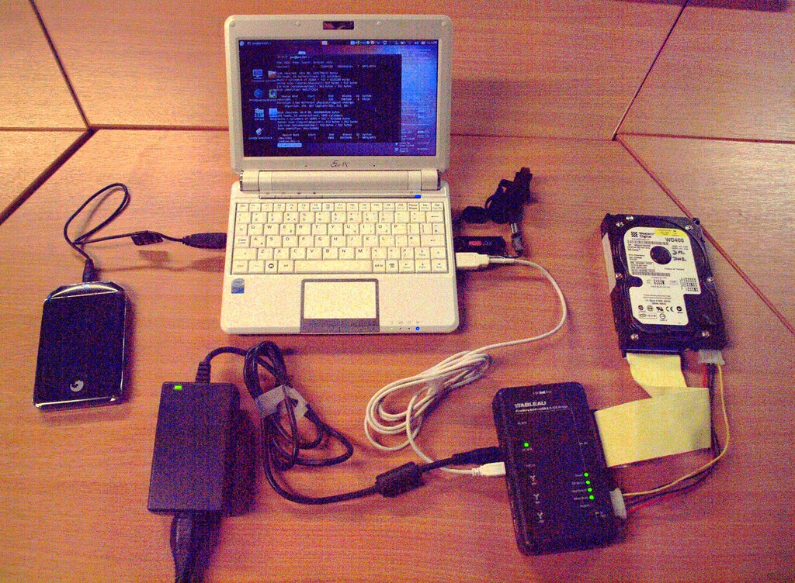

# forensic-imaging-quickstarts
Forensic Imaging quickstarts!

## Standards Bodies
- US National Institute of Standards and Technology (NIST)
- NIST has the program: Computer Forensic Tool Testing (CFTT)
- ISO (ISO/IEC 27037:2012) (provides guidlines)
- UK - Association of Chief Police Officers (ACPO) - Provides: ACPO *Good Practice Guide for Digital Evidence*
- DOJ maintains *Electronic Crime Scene Investigation: A Guide fo First Responders*
- Research journal (academic): *Digital Investigation: The International Journal of Digital Forensic & Incident Response*
- Conference: Digital Forensics Research Workshop (DFRWS)

### For the private sector
- Assurance Advisory Council (IAAC) provides: *Directors and Corporate Advisors' Guide to Digital Investigations and Evidence*
- Legal: US Sarbanes-Oxley legislation

To note:
> Each industry from healthcare to telecom to banking will have different standards and regulations.

For banking as an example: Monetary Authority of Singapore (MAS)

**CFTT** is for the establishment of methodologies for testing computer forensic software tools by development of general tool specifications, test procedures, test criteria, test sets, and test hardware.

## Open Source (Linux) vs Commercial forensic software
### Advantages (Open Source)
- Accessible to anyone
- Examine the code is possible
- No need to sign nondisclosure agreements
- You can modify the source code
    - Easier to automate
    - You can more easily integrate with other software
    - You can modify the code to meet the requirements of a particular forensic lab
- You have mailing lists, chat other types of forums
- Ideal for academic
- Development community work with each other even if tehy compete
### Disadvantages (Open Source)
- Support is not reliable nor accurate nor trustworty (at times)
    - Commercial software often have 24/7 support and is more reliable
- Reaching out to the public to get help you could reveal sensitive information
- Interoperability with proprietary technologies with open source is often incomplete or not implementing some function properly
- Some project are abandoned or neglected (e.g.: OpenSSL)
- When in court the commercial software company can defend their product
- Open Source is better for educational reasons

## Resources
### Books
- [Practical Forensic Imaging | Securing Digital Evidence with Linux Tools
by Bruce Nikkel](https://nostarch.com/forensicimaging) (ISBN-13: 978-1-59327-793-2) [Amazon.ca](https://www.amazon.ca/Practical-Forensic-Imaging-Securing-Evidence/dp/1593277938/ref=sr_1_1?crid=77TB014JA0DR&keywords=Practical+Forensic+Imaging&qid=1653000842&sprefix=practical+forensic+imaging+%2Caps%2C203&sr=8-1)
- [File System Forensic Analysis](https://digital-evidence.org/fsfa/) [Amazon.ca](https://www.amazon.ca/System-Forensic-Analysis-Brian-Carrier/dp/0321268172/)
### Videos
- [Digital Forensics Using Kali Linux : Forensics Imaging Overview | packtpub.com | YouTube](https://www.youtube.com/watch?v=fWtJMLEUkxg)
- [Digital Forensics with Kali Linux : Introduction to Forensic Imaging | packtpub.com | YouTube](https://www.youtube.com/watch?v=QjVzLRBuR7c)
### Websites
- [Home - DFRWS](https://dfrws.org/) - DFRWS (Digital Forensic Research Workshop) *is a non-profit, volunteer organization dedicated to bringing together everyone with a legitimate interest in digital forensics to address the emerging challenges of our field. DFRWS organizes digital forensic conferences, challenges, and international collaboration to help drive the direction of research and development.*
    - [Forensics Wiki (DFRWS)](https://forensicswiki.xyz/)
- [Brian Carrier: Digital Investigation / Forensics and  Evidence Research](https://digital-evidence.org/)
- [The 6 Best Linux File Recovery Software | FOSS Linux](https://www.fosslinux.com/41727/the-6-best-linux-file-recovery-software.htm)
- [CDRoller - Reading Data CD ( CDROM , CD-ROM XA ,etc.)](https://www.cdroller.com/htm/readdata.html)
- [Partition types](https://www.win.tue.nl/~aeb/partitions/partition_types.html)
- [Forensic Technology Center of Excellence - A program of the National Institute of Justice](https://forensiccoe.org/)
    - [Just Digital Forensics Program Development and Outlook](https://forensiccoe.org/podcast-2022fepac-ep3/) (https://nij.ojp.gov/library/publications/just-science-podcast-just-digital-forensics-program-development-and-outlook)
    - [Just Literature on Stress & Resiliency in Forensic Science](https://forensiccoe.org/2021-workforce-resiliency-ep4/) (https://nij.ojp.gov/library/publications/just-science-podcast-just-literature-stress-resiliency-forensic-science)
- [International Journal of Digital Evidence](https://dblp.org/db/journals/ijde/index.html)
- [Scientific Working Group on Digital Evidence (SWGDE)](https://www.swgde.org/) Specified definitions and standards (including Standard Operating Procedures (SOPs)) for law enforcement
- [US DOJ Electronic Crime Scene Investigation: A guide for First Responders](https://www.ojp.gov/pdffiles1/nij/219941.pdf)
- [University At Albany - Capital Region Cyber Crime Partnership (CRCCP)](https://www.albany.edu/crccp/resources.html)
- [10 Best Security Live CD Distros (Pen-Test, Forensics & Recovery) (old article from 2006)](https://www.darknet.org.uk/2006/03/10-best-security-live-cd-distros-pen-test-forensics-recovery/)
- [New Approaches to Digital Evidence Acquisition and Analysis | National Institute of Justice](https://nij.ojp.gov/topics/articles/new-approaches-digital-evidence-acquisition-and-analysis)
- [Improving the Collection of Digital Evidence | National Institute of Justice](https://nij.ojp.gov/topics/articles/improving-collection-digital-evidence) (Usage of AI (deep learning))
- [Device Forensics | Grier Forensics](https://www.grierforensics.com/capabilities/device-forensics/)
- [Digital Evidence and the U.S. Criminal Justice System | Office of Justice Programs](https://www.ojp.gov/pdffiles1/nij/grants/248770.pdf)
- [Publications Listing | Office of Justice Programs](https://nij.ojp.gov/library/publications/list?subtopic=5741)
- [Tweaking4All.com - Linux - HandBrake - Copy a DVD to MP4 or MKV file](https://www.tweaking4all.com/video/rip-dvd-blu-ray/linux-handbrake-copy-a-dvd-to-mp4-or-mkv-file/)
- [How to Rip DVDs With VLC - Linux Tutorials - Learn Linux Configuration](https://linuxconfig.org/how-to-rip-dvds-with-vlc)
- [Top 5 Linux DVD RIP Software - nixCraft](https://www.cyberciti.biz/tips/linux-dvd-ripper-software.html)
- [How to Rip a DVD (with Pictures) - wikiHow](https://www.wikihow.com/Rip-a-DVD)
- [Ubuntu Linux play encrypted DVDs - nixCraft](https://www.cyberciti.biz/faq/howto-ubuntu-linux-playback-dvd/)
    - `sudo apt-get install vlc xine mplayer libdvdread3`
    - `sudo /usr/share/doc/libdvdread3/examples/install-css.sh`
- [How to install libdvdcss in Ubuntu / Debian to play DVDs - nixCraft](https://www.cyberciti.biz/faq/installing-plugins-codecs-libdvdcss-in-debian-ubuntu-linux/)
- [NTFS Undelete Test #1](http://dftt.sourceforge.net/test7/)
- [Digital (Computer) Forensics Tool Testing Images](http://dftt.sourceforge.net/)
- [Awesome Forensics Resources. Almost 300 open source forensics tools, and 600 blog posts about forensics](https://github.com/alphaSeclab/awesome-forensics)
- [Digital Forensics Guide](https://github.com/mikeroyal/Digital-Forensics-Guide)
### Tools
- https://github.com/CIRCL
- [The Sleuth Kit (TSK) & Autopsy: Open Source Digital Forensics Tools](http://www.sleuthkit.org/) [The Sleuth Kit | GitHub](https://github.com/sleuthkit)
- [TestDisk, Data Recovery](https://www.cgsecurity.org/wiki/TestDisk)
- [PhotoRec](https://www.cgsecurity.org/wiki/PhotoRec)
- [Ddrescue - Data recovery tool | GNU Project](https://www.gnu.org/software/ddrescue/)
- [safecopy](http://safecopy.sourceforge.net/)
- [Redo Rescue: Backup and Recovery](https://sourceforge.net/projects/redobackup/) - [GitHub](https://github.com/redorescue/redorescue) - [Main website](http://redorescue.com/)
- [Mondo Rescue - GPL disaster recovery solution](http://www.mondorescue.org/)
- [DFORC2](https://github.com/RANDCorporation/DFORC2) (DFORC2 is a cloud-based digital forensics platform, developed at the RAND Corporation and backed by Autopsy and The Sleuth Kit. This repository is used to deploy the DFORC2 backend to AWS with Kubernetes. The backend also incorporates the autopsy-jar and spark-streaming-apps repositories. The DFORC2 frontend client comprises RAND's Linux-compati…)
    - [DFORC2 | JNBDZ (fork)](https://github.com/jnbdz/DFORC2)
- [AcidRip](https://sourceforge.net/projects/acidrip/)
- [HandBrake – Versatile DVD ripper and video transcoder for Linux](https://handbrake.fr/) `sudo apt-get install handbrake handbrake-cli`
- DVD::RIP – Front end for transcode and ffmpeg: `sudo apt-get install dvdrip`
- [dvdbackup – Tool to rip DVD’s from the Linux command line](https://wiki.archlinux.org/title/dvdbackup) `sudo apt install dvdbackup`
- thoggen – DVD backup utility (‘DVD ripper’) for Linux: `sudo apt-get install thoggen`
- `libdvdcss2` – Simple foundation for reading DVDs – runtime libraries.
- `libdvdnav4` – DVD navigation library.
- `libdvdread4` – library for reading DVDs.
- [MEncoder](http://www.mplayerhq.hu/MPlayer/DOCS/HTML/en/mencoder.html)
- [Hybrid | can convert most input formats to common audio & video formats and containers, see feature list for details.](https://www.selur.de/)
- [Tracking history of USB events on GNU/Linux](https://github.com/snovvcrash/usbrip)
- [Web browser forensics for Google Chrome/Chromium ](https://github.com/obsidianforensics/hindsight)
- [Andriller - is software utility with a collection of forensic tools for smartphones. It performs read-only, forensically sound, non-destructive acquisition from Android devices](https://github.com/den4uk/andriller)
- [MemLabs | Educational, CTF-styled labs for individuals interested in Memory Forensics](https://github.com/stuxnet999/MemLabs)

## Credits
- [basic-forensics-imaging-kit.jpg (.png)](https://search.openverse.engineering/image/27a83bbf-c46f-422e-8089-c65100339566)
- [tux-inflated.jpg (.png)](https://search.openverse.engineering/image/c3823873-89bd-41b3-9989-67bfe5ea3e61)
