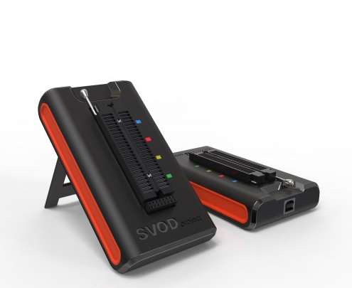

# SVOD-project | Forensic Imaging | Quickstarts
This section is about the [SVOD-project](https://svod-project.com/en/) tool and how to use it.

## Resources
- [SVOD store](https://shop.svod-project.com/)
### Videos
- [how to use programmer SVOD A-Z | YouTube](https://www.youtube.com/watch?v=S_zSDy5KqcE) - You can use the captions if you don't understand.
- [Svod 3 | Svod 4 | Universal Programmer Simple | Easy | Fast | Reliable | YouTube](https://www.youtube.com/watch?v=F8A-t4449kQ)
- [How to install Svod - 3 | Svod-4 universal bios programmer in (Tamil language) | YouTube](https://www.youtube.com/watch?v=n_JuTorV42E) - You can use the captions.
